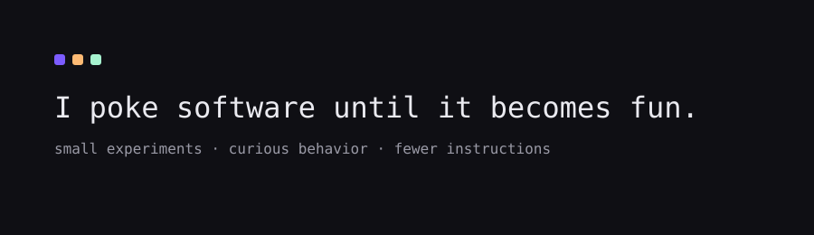

<h1 align="center">I poke software until it becomes fun.</h1>

small experiments • playful interfaces • fewer instructions

---

### what this place is

Not a portfolio.  
More like a lab notebook.

I build things to understand behavior — then remove the parts humans shouldn't need to think about.

---

### current obsessions

- interfaces that teach instead of explain
- removing unnecessary user choices
- interactive onboarding
- small delightful behaviors

---

### selected experiments

| project | goal |
|------|------|
| ReviewVista | collect testimonials without chasing people |
| alarm-that-you-cant-ignore | waking up requires intent |
| ui-that-guides | interface explains itself |
| onboarding-without-docs | learning by interaction |

---

### how I build

1. find confusion
2. remove options
3. prototype interaction
4. then write code

---

### note

Some projects stay unfinished on purpose.  
Understanding > shipping fast.
